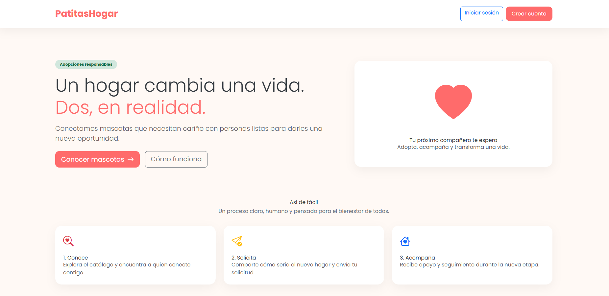
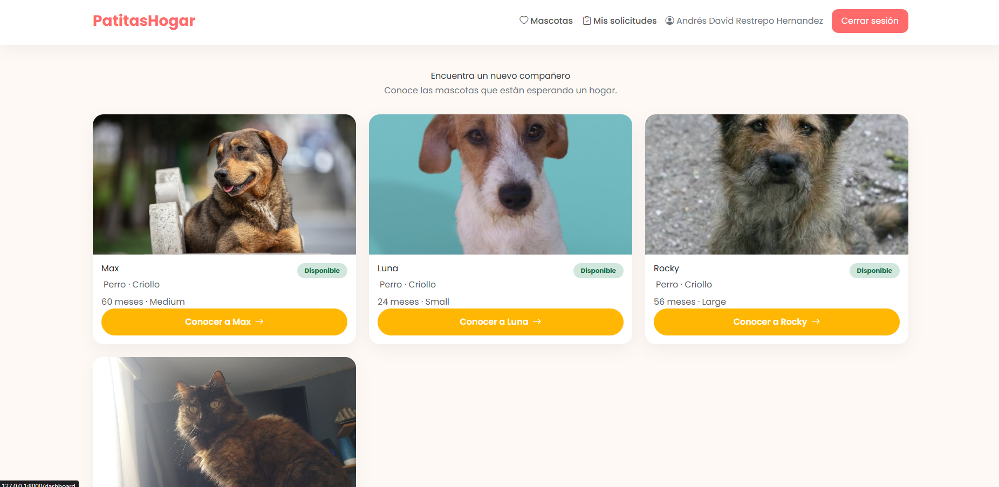
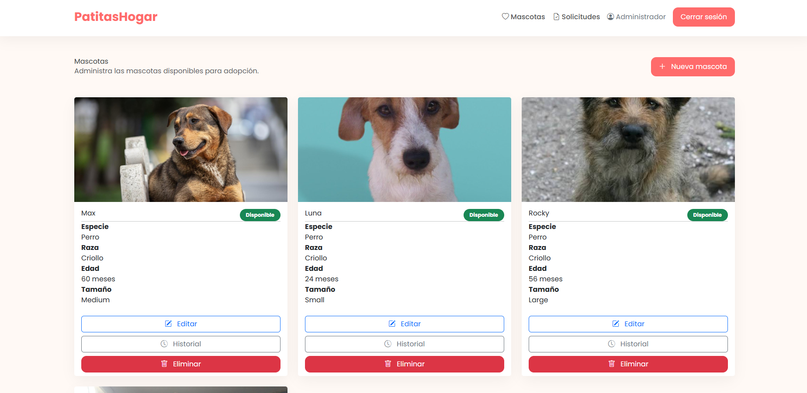
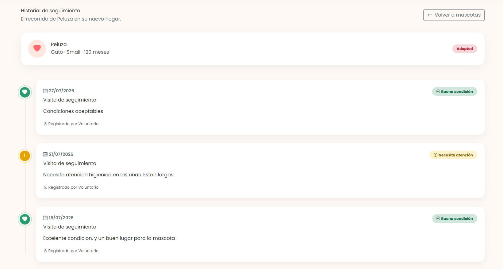

# 🐾 PatitasHogar

**Estudiante:** Andrés David Restrepo Hernández

## LINK:

## VIDEO:

## 📋 Descripción

PatitasHogar es una aplicación web desarrollada en **Laravel** para la gestión de adopciones de mascotas. Permite administrar el catálogo de animales disponibles, gestionar las solicitudes de adopción y hacer seguimiento post-adopción a través de visitas de voluntarios. El sistema maneja tres roles de usuario: **administrador**, **voluntario** y **adoptante**, cada uno con sus propias vistas y permisos.

### Funcionalidades principales

- **Administrador:** gestión (CRUD) de especies y mascotas, revisión y aprobación/rechazo de solicitudes de adopción, consulta del historial de seguimientos.
- **Adoptante:** navegación del catálogo de mascotas disponibles, envío de solicitudes de adopción, consulta de sus propias solicitudes.
- **Voluntario:** registro de visitas de seguimiento a mascotas adoptadas, con notas y estado de la mascota.

## 🗄️ Tablas implementadas y sus relaciones

| Tabla | Descripción | Campos principales |
|---|---|---|
| `users` | Usuarios del sistema (administradores, voluntarios y adoptantes) | `name`, `email`, `password`, `role` (`admin`, `volunteer`, `adopter`), `address`, `phone` |
| `species` | Especies de mascotas disponibles para adopción | `name` |
| `pets` | Mascotas disponibles en el sistema | `species_id` (FK), `name`, `breed`, `age_months`, `size` (`small`, `medium`, `large`), `description`, `photo`, `status` (`available`, `in_process`, `adopted`) |
| `adoption_requests` | Solicitudes de adopción realizadas por los adoptantes | `pet_id` (FK), `adopter_id` (FK → `users`), `status` (`pending`, `approved`, `rejected`), `reason`, `home_type`, `has_other_pets`, `reviewed_by` (FK → `users`), `reviewed_at` |
| `follow_ups` | Seguimientos realizados por voluntarios a las adopciones aprobadas | `adoption_request_id` (FK), `volunteer_id` (FK → `users`), `visit_date`, `notes`, `pet_condition` (`good`, `needs_attention`) |

### Relaciones entre tablas

- **`species` → `pets`**: una especie puede tener muchas mascotas (`1:N`). Al eliminar una especie, se eliminan en cascada sus mascotas.
- **`pets` → `adoption_requests`**: una mascota puede tener muchas solicitudes de adopción (`1:N`). Al eliminar una mascota, se eliminan sus solicitudes.
- **`users` → `adoption_requests`**: un usuario (adoptante) puede tener muchas solicitudes (`1:N`), a través de `adopter_id`. Además, un usuario (administrador) puede revisar muchas solicitudes, a través de `reviewed_by`.
- **`adoption_requests` → `follow_ups`**: una solicitud de adopción aprobada puede tener muchos seguimientos (`1:N`).
- **`users` → `follow_ups`**: un usuario (voluntario) puede registrar muchos seguimientos, a través de `volunteer_id`.

```
species (1) ──< (N) pets (1) ──< (N) adoption_requests (1) ──< (N) follow_ups
                                        │        │                    │
                                        │        └──> users (reviewed_by)
                                        └──> users (adopter_id)      └──> users (volunteer_id)
```

## ⚙️ Instrucciones para correr localmente

### Requisitos previos

- PHP >= 8.3
- Composer
- Node.js y npm
- MySQL (servidor local o remoto)

### Pasos

1. **Clonar el repositorio**
   ```bash
   git clone https://github.com/AdRestreph/PatitasHogar.git
   cd PatitasHogar
   ```

2. **Instalar dependencias de PHP**
   ```bash
   composer install
   ```

3. **Instalar dependencias de JavaScript**
   ```bash
   npm install
   ```

4. **Configurar el archivo de entorno**
   ```bash
   cp .env.example .env
   php artisan key:generate
   ```

5. **Configurar la base de datos**

   Crea una base de datos en tu servidor MySQL, por ejemplo:
   ```sql
   CREATE DATABASE patitashogar;
   ```

   Luego edita el archivo `.env` con tus credenciales de MySQL:
   ```env
   DB_CONNECTION=mysql
   DB_HOST=127.0.0.1
   DB_PORT=3306
   DB_DATABASE=patitashogar
   DB_USERNAME=root
   DB_PASSWORD=
   ```

6. **Ejecutar las migraciones (y seeders, si aplica)**
   ```bash
   php artisan migrate --seed
   ```

7. **Enlazar el almacenamiento** (necesario para las fotos de las mascotas)
   ```bash
   php artisan storage:link
   ```

8. **Compilar los assets del frontend**
   ```bash
   npm run dev
   ```

9. **Levantar el servidor de desarrollo**
   ```bash
   php artisan serve
   ```

10. Abrir el navegador en [http://localhost:8000](http://localhost:8000)

## 📸 Capturas de pantalla


| Página de inicio | Catálogo de mascotas |
|---|---|
|  |  |

| Panel administrador | Seguimiento de voluntario |
|---|---|
|  |  |

## 🛠️ Tecnologías utilizadas

- **Backend:** Laravel 13 (PHP 8.3)
- **Frontend:** Bootstrap 5, Alpine.js, Vite
- **Base de datos:** MySQL
- **Autenticación:** Laravel Breeze